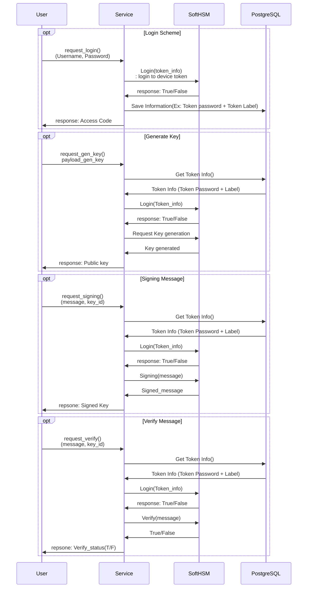

# django-hsm-softhsm2-postgresql
Minimal implementation of SoftHSM2 + Django + PostgreSQL

Create minimal implementation:
- Key generation
- Message Signing
- Message Verification

```mermaid
sequenceDiagram
    opt Login Scheme
        User ->> Service: request_login() <br> (Username, Password)
        Service ->> SoftHSM: Login(token_info) <br> : login to device token
        SoftHSM ->> Service: response: True/False
        Service ->> PostgreSQL: Save Information(Ex: Token password + Token Label)
        Service ->> User: response: Access Code
    end
    opt Generate Key
        User ->> Service: request_gen_key() <br> payload_gen_key
        Service ->> PostgreSQL: Get Token Info()
        PostgreSQL ->> Service: Token Info (Token Password + Label)
        Service ->> SoftHSM: Login(Token_info)
        SoftHSM ->> Service: response: True/False
        Service ->> SoftHSM: Request Key generation
        SoftHSM ->> Service: Key generated
        Service ->> User: response: Public key
    end
    opt Signing Message
        User ->> Service: request_signing() <br> (message, key_id)
        Service ->> PostgreSQL: Get Token Info()
        PostgreSQL ->> Service: Token Info (Token Password + Label)
        Service ->> SoftHSM: Login(Token_info)
        SoftHSM ->> Service: response: True/False
        Service ->> SoftHSM: Signing(message)
        SoftHSM ->> Service: Signed_message
        Service ->> User: repsone: Signed Key
    end
    opt Verify Message
        User ->> Service: request_verify() <br> (message, key_id)
        Service ->> PostgreSQL: Get Token Info()
        PostgreSQL ->> Service: Token Info (Token Password + Label)
        Service ->> SoftHSM: Login(Token_info)
        SoftHSM ->> Service: response: True/False
        Service ->> SoftHSM: Verify(message)
        SoftHSM ->> Service: True/False
        Service ->> User: repsone: Verify_status(T/F)
    end
```